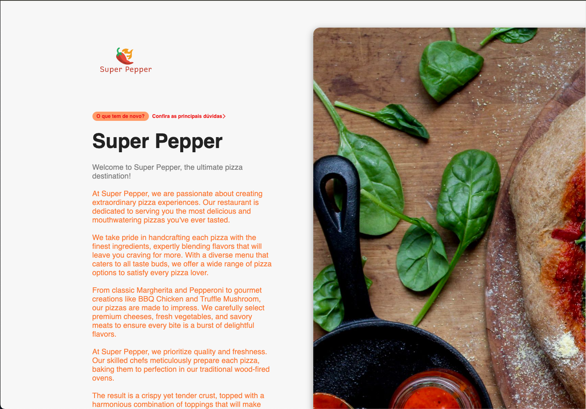

# simple-navigation-next

Prerequisites
Before you begin, make sure you have the following installed on your system:

Node.js: version 12 or higher
NPM (Node Package Manager) or Yarn
Step 1: Clone the repository
Open the terminal or command prompt.

Navigate to the directory where you want to clone the repository.

Run the following command to clone the repository:

[](https://github.com/unicodeveloper/awesome-nextjs)

Clone this repo and use it as a starting point for your own blog.




**NOTE:** Make sure to run `npm run build:content` before `npm start` for the first time.

## Install dependencies

```sh
npm install
```

## Build content

```sh
npm run build:content
```

## Run development server

```sh
npm start
```

## Build for production

```sh
npm run build
```

## TODO

- Add RSS feed support
